# Generating Stock Market Insights

This is my ML project where I explore various trends of the stock market. I decided to undertake this project to explore real stock market data in the US, and to generate meaningful insights that would help me understand a bit more about stock price movements and trends by using my existing ML knowledge and skills. I also aim to expand my ML skills by solving real world problems using real world data, which is my key motivation.

I plan to explore different problems in this repository, and I will cover each problem as part of this document to provide the necessary details for each.

## Problem 1 - Time-series trend classification

### Problem Definition:   
This is a multi-class classification problem where I use 30-day OHLCV data on different stocks. ***(OHLVC is a standard format used to represent daily price and volume data  for any traded asset. It represents Opening price, Highest price, Lowest price, Closing price, and Volume (or number) of shares traded )***

My challenge is to find out whether the OHLCV data on different stocks will allow me to train ML models that can categorize a given stock as one of the following 5 classes: 

**1. Trending up *(class name: TREND_UP)*:** This indicates a strong upward slope over the 30-day period without extreme volatility.

**2. Trending down *(class name: TREND_DOWN)*:** This indicates a strong downward slope over the 30-day period without extreme volatility.

**3. Stationary *(class name: STATIONARY)*:** This indicates there is neither a strong upward or downward slope over the 30-day period, and no volatility in that same time period.

**4. Oscillating *(class name: OSCILLATING)*:** This indicates there is too much upward and downward variation within the 30-day period. In other words, the stock price flips direction too frequently.

**5. No distinct trend *(class name: OTHER)*:** Any trend that cannot be classified as one of the above 4 will be categorized as OTHER.

### First things first - What is meant by "price"?
While talking about my technical approach in the rest of this section, you will come across the word "price" often. I already mentioned the OHLCV data we will use has 4 different prices: Opening, Closing, (Daily) High and (Daily) Low. However, I did not mention which one of those 4 different prices I will be using while creating a solution to Problem 1, which I will try to clarify here.

There is no simple answer to which price you should use as it depends on what you would like to calculate and how detailed you would like your analysis to be. To keep things simple (especially for your initial design) you can simply choose one of Open, Close, High or Low prices listed for each day for a stock ticker, and use it as your reference for calculating all of the metrics (which will be explained in detail later) This is the simplest approach and does not require computation of additional features related to price.

Note a stock can go for an unexpected split that introduces price inconsistencies over time, and this can be fixed by using the "Adjusted" versions of the prices. Typically, most finance APIs provide a price and its adjusted version (e.g., Close and Adjusted Close as can be requested using yfinance python library)

Unless stated otherwise, in the rest of this section, "price" will refer to "Adjusted Close" price. If you are interested in exploring additional price metrics to experiment with, you can refer to my <a href="readme_images/price_definitions.pdf">price definitions</a> where I summarize different types of prices and their uses.


### Feature Definitions:
The 5 classes we defined are based on the "shape" of the 30-day price change. Therefore, the useful features will be the "shape-defining" ones, and will help us develop machine learning models.

Following are the 4 shape-defined core features I will be using. These are the minimum set of features that will help me create a credible classifier.

***1. Slope of linear fit:*** We simply fit a straight line on the prices inside the 30-day frame for a given stock, and calculate the slope (b) of that line.

***Note:*** *Using log of prices rather than the raw stock prices while fitting a line is a good approach for the following reasons:*
- Log prices make trend and volatility measures scale-invariant across different stocks.
- Log prices also allow comparison between different timelines (where absolute price difference in the same stock may be vastly different-e.g., price in 2005 vs. 2025)
- Log prices align naturally with log returns as well (as will be discussed shortly).
- Using logs gives more stable statistical behavior for window-based classification.

***CAUTION 1:*** *When using log of prices, keep in mind ln(0) is undefined. Therefore, you need to pre-filter zero dollar prices prior to applying log to them !!*

***CAUTION 2:*** *When using log of prices, slope b will measure the relative drift rather than the absolute price drift of the stock.*

***CAUTION 3:*** *If you calculate b based on log prices, it will approximately be equal to the (fixed) percentage change in price over time (especially true for small b values). This is regardless of the stock price, which allows direct comparison between different stocks in our solution.*

*Using raw prices will make sense in the case of the following:*
- When analyzing one stock ticker only
- Price level itself is meaningful
- Interpretability  in absolute ($) units matters
- You want shapes defined by dollar movement, not relative movement


***2. Trend strength ratio:*** Trend strength ratio indicates whether the upward or the downward trend of the 30-day frame is a strong or a weak one. This metric is calculated as shown below where the numerator is the slope magnitude of the line of best fit and the denominator is the standard deviation of all the samples in the 30-day frame. 

<div align="center">
  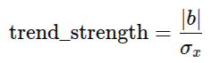
</div>

***Important:*** *If you calculate the |b| based on the log of prices in the 30-day frame rather than the raw prices, the standard deviation also has to be calculated using the log of prices in that same 30-day frame for consistency!*


***3. Volatility from returns:*** Volatility is defined as the standard deviation of returns, and it measures how much the signal fluctuates relative to its average behavior. We first convert raw prices to "returns" as working with returns has the following advantages:  
- It removes scale (e.g., a $10 stock can be compared to a $500 one)
- It stabilizes variance
- It captures relative movement instead of absolute price level

For each 30-day frame, we can calculate 29 simple return values as follows:
<div align="center">
  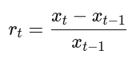
</div>

We then calculate the mean return value and calculate the volatility (v), which is simply the standard deviation of returns within the 30-day frame as follows (note N=29 in a 30-day frame): 

<div align="center">
  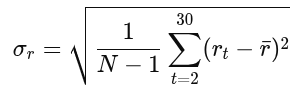
</div>

***Note:*** *Using log returns instead of simple returns as described above may work better statistically. Following is how you calculate a daily log return:*

<div align="center">
  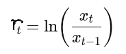
</div>

*There are three key reasons why log returns will make sense:*

***Reason 1 -*** *Log returns preserve total movement across a window exactly. For example, if a price moves +10% one day and -10% the next day, for a $100 stock, simple returns gives,* 

Total return: +0.10 - 0.10 = 0

*However, the price movement is not flat:*

100 -> 110 -> 99

*If we look at the same change using log returns,*

Total return: ln(110/100) + ln(99/110) = ln(99/100)

*which means we can use them "additively".*

***Reason 2 -*** *Simple returns are NOT symmetrical while log returns are - due to the mathematical property of logarithms: ln(a) = -ln(1/a)*

*Consider a price that doubles first and then halves as follows:*

100 -> 200 : *in simple returns this yields %100*  
200 -> 100 : *in simple returns this yields -%50*

*Even though the final price is still where it first started, the positive and negative returns are numerically NOT symmetrical!*

*Now in the case of the same example, when log returns are used instead:*

100 -> 200 : *in log returns this yields +0.693*  
200 -> 100 : *in log returns this yields -0.693*

*which represents a symmetric change!*

*This is important because:*   
- *Positive and negative moves contribute equally*
- *Variance reflects true fluctuation magnitude*
- *Distribution is closer to symmetric and stable*

***Reason 3 -*** *If your dataset includes stock tickers with very different price levels, using log returns will allow you to compare them.*

***Key takeaway:** Volatility becomes a cleaner measure of "movement intensity" when log returns are used instead of simple returns!*

***4. Zero-crossing rate (ZCR):*** The goal here is to quantify how often the 30-day series price changes direction (i.e., up -> down or down -> up). ZCR is a strong indicator of an oscillating pattern.

Though the name suggests there is a negative to positive transition around zero, what is meant here is a "sign change" of how the price of a stock is moving. First, we calculate the price difference between two consecutive days (dt). If dt < 0, the price has decreased while dt > 0 indicates a price increase. In a 30-day frame, we can have 29 price differences at most.

The "sign change" refers to whether a positive or negative difference between successive differences is maintained over time. For example,

daily prices:           x1, x2, x3, x4, x5, x6
price differences:      x2-x1, x3-x2, x4-x3, x5-x4, x6-x5
sign of differences:    s1 = sign(x2-x1), s2 = sign(x3-x2), s3 = sign(x4-x3), s4=sign(x5-x4), s5=sign(x6-x5)
sign changes        :   s1 ?= s2, s2 ?= s3, s3 ?= s4, s4 ?= s5

Therefore, for 'n' prices, we will calculate 'n-1' differences, and have a maximum of 'n-2' sign changes.

We count the number of sign changes (i.e., zero crossing count) as follows:
<div align="center">
  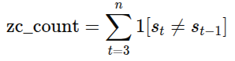
</div>

Then we calculate the rate (i.e., ZCR) as follows:
<div align="center">
  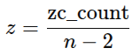
</div>

z=0 means the price trend never changes direction while z=1 means the price trend direction changes each day (highly oscillatory)

***Note:*** *If price does not change from one day to the next, the sign() will indicate 0. As a result, calculating a sign difference will not be possible. For such cases, ignoring the transitions involving 0 will make sense. This will be equivalent to dropping day transitions where price difference is zero.*  
*An alternative (and a better) method is to replace the "no sign change" element to the sign of the previous comparison. That way no elements will be dropped and therefore the zero crossing ratio will always be calculated the same denominator (i.e., N-2)*

### Calculation of thresholds:
Now that we covered the metrics that will be used in defining our ground truth for the classification task, next we need to define (or compute) a few thresholds for those metrics to decide on how to classify each 30-day frame in our dataset.

While defining these thresholds one thing we need to watch out for is ***not to make them dependent on the dataset*** by, for example, defining percentiles computed using the entire dataset! This approach would jeopardize the generalizability of our models as the percentile based thresholds are unlikely to be valid for future unseen data. Therefore, our threshold definitions will be based on daily price changes and/or each 30-day frame. We will also use empirical approaches based on human visual perception while defining these thresholds. Obviously, the intuitive thresholds chosen can always be changed later, if needed, to improve performance.

Before describing the thresholds, let's talk about the slope magnitude |b| and the regions where that value might fall in our dataset. There are three regions we need to keep in mind when working with |b| as shown below defined by two thresholds y1 and y2.

<div align="center">
  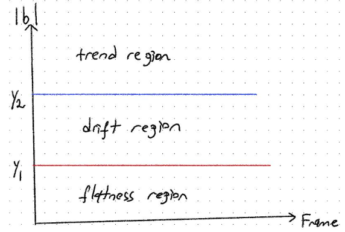
</div>

When a calculated |b| exceeds y2, it indicates a strong trend, which means the slope strongly moves upwards or downwards (depending on the sign of the slope)

When |b| is below threshold y1, it means there is no strong upward or downward trend and the slope indicates a flat line (which basically means the price over the 30-day period is almost flat)

The transition region that falls between the y1 and y2 thresholds is called the drift region, where the slope may or may not indicate a strong trend because:  
- noise may still dominate
- direction may not persist
- shape of the line is unstable

The above three zone structure for slope magnitude will be important to remember when considering the "trend direction thresholds" and the "near-zero threshold" below.

***1. Trend direction threshold:*** The trend will be calculated based on the slope (b) of the log of daily prices in a 30-day frame as follows.

<div align="center">
  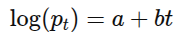
</div>

This means the daily price can be calculated as:

<div align="center">
  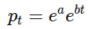
</div>

In order to see how much a price changes from one day (t) to the next (t+1), we can use the following ratio:

<div align="center">
  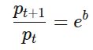
</div>

Since we are trying to define a threshold for slope b, where small negative or positive slopes will need to be somehow defined, the following identity that is true for small b values can be used.

<div align="center">
  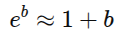
</div>

This means when log prices are used, ***slope b is an approximation of percentage price growth per day*** over a 30-day frame!

Empirically, when the broad US equity universe is considered, **daily drift/change (magnitude) above ~0.3% is considered trend-dominant.** This means we can define the following thresholds to categorize strong upward/downwad trends:

b(up) >= 0.003 *(to check strong upward trend)*
b(up) <= -0.003 *(to check strong downward trend)*

Note we are able to define the threshold symmetrically because log-price slopes are symmetric! (i.e., +1%/day and -1%/day represent equivalent strength in opposite directions!)


***2. Near-zero slope threshold:*** This threshold is the level below which a daily drift direction becomes visually and statistically indistinguishable from noise over a 30-day window.

Over a 30-day window, a 3% move upwards or downwards is subtle, and is within what random fluctuations can produce. Human perception cannot recognize such low level of movement as trend over a 30-day period. Therefore, a maximum of 3% cumulative movement can be used as the threshold that separates the visually and statistically distinguishable directional changes from stationary ones.

Following is how we calculate the near-zero slope threshold, which indicates flatness using the 30-day cumulative movement limit of 3%. 

<div align="center">
  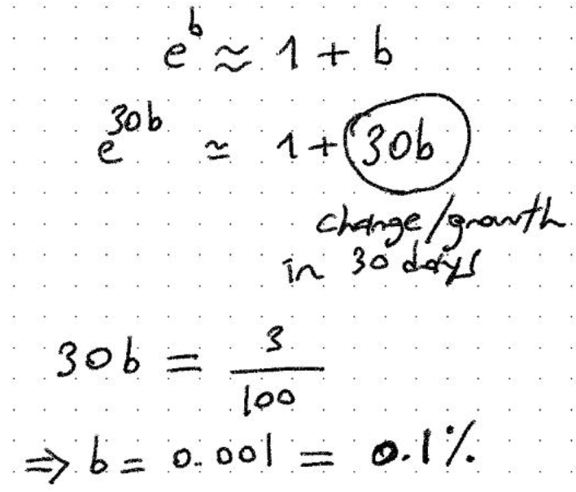
</div>

To sum up,

|b| <= 0.001 *indicates a near-zero slope, i.e. a flat window*  
|b| > 0.001 *indicates a non-flat window*

For clarification, any |b| that falls between 0.001 and 0.003 indicates a movement in the drift region as I described in an earlier plot. 30-day frames that fall into this drift region will be classified as OTHER as we will see later in the label mapping section.

***3. Trend strength (TS) threshold:*** Previously, I showed how to calculate TS as a ratio of daily drift and the daily movement. We can interpret TS as a "daily signal-to-noise" ration (SNR) as well to help us calculate a reasonable threshold. Let's first derive the equation that will help us define a reasonable threshold based on SNR.

<div align="center">
  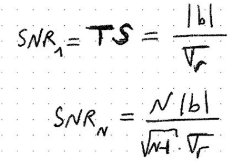
</div>

The first equation above is the trend strength I introduced earlier that represents daily fluctuations. Therefore, this expression can be seen as SNR(1). By simply multipying the numerator and the denominator with the respective number of days (N) expressions, we can calculate a cumulative SNR. Note the square root expression in the denominator is based on the earlier standard deviation calculation I shared based on the cumulative returns over 'N' days.

As the next step, we simply plug in N=30 since we are interested in 30-day windows in our analysis. Notice how the 30-day SNR is expressed as a function of the trend strength (TS), which is what we need to define a threshold for.

<div align="center">
  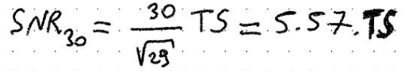
</div>

While there are different SNR values we can pick to help us define a reasonable threshold for TS, we need to make sure the directional displacement (indicated by |b|) is visually stable and discernible compared to the random fluctuation (i.e., the standard deviation term - volatility) If the directional displacement is twice as large as the random fluctuation, this will provide a measure that allows humans to recognize a trend in the data. Any SNR lower than 2 typically gives ambiguous shapes caused by sign and magnitude ambiguities. Therefore, as the final step in our formulation, we have:

<div align="center">
  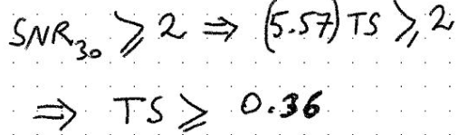
</div>

We can now finalize our threshold for trend strength as:  
TS >= 0.36 *indicates a strong upward or downward trend*  
TS < 0.36 *indicates a weak/no trend*

***4. Oscillation threshold:*** In order to calculate this threshold, we need to use the binomial tail probability.

In a binomial probability calculation, we need to define "number of trials" and "probability of success" to start with. For our oscillation calculation, we use the number of zero crossings (i.e., ZCR) we computed earlier. So a "trial" can be defined as the number of sign change comparisons we can have in a 30-day frame.

We also define "success" as a sign change (i.e., an occurrence of a zero crossing event). Next we need to define the "probability of success". Here we consider the level of success in the case of a valid trend observation where the ZCR should be low.

Now we can write the expression for computing the probability that a **non-oscillatory** 30-day window accidentally looks oscillatory as follows:

<div align="center">
  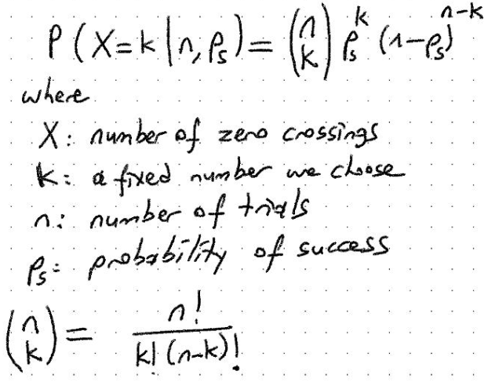
</div>

Note the above equation calculates the probability for a 'k' value we fix as the number of sign changes. However, an oscillatory behavior will become more prominent as the number of sign changes increases. Therefore, we need to modify the above probability calculation to cover a range of sign changes rather than a fixed number of sign changes as follows.

<div align="center">
  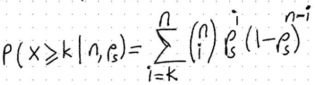
</div>

In the updated version, we are now considering a minimum value 'k' as well as higher number of sign changes up to a maximum of "n". As a result, our probability calculation becomes a *sum of independent probabilities*.

The last probability calculation is the *false positive rate* of accidentally categorizing a trend window as oscillatory, which is something we want to minimize, obviously. Therefore, we use the following inequality where a false positive probability (p(fp)) is also included.

<div align="center">
  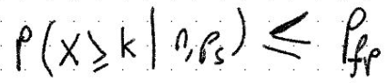
</div>

Let's now pick reasonable values for some of the parameters to create the inequality we will solve to compute the oscillation threshold we will use to define our classification.

The maximum number of sign changes that can occur in a 30-day window is 30-2=28, as we also calculated earlier. The success probability refers to the expected level of sign changes in a valid trend window, which we should set at a low level (since by definition a trend window should have good sign stability). Success probability of 0.3 is a reasonable level that is neither overconstraining nor too relaxed. Last but not least, we need to define a false positive rate that is low enough to accurately classify the oscillatory frames. Let's set the false positive rate to 5% with that in mind.

When we plug in the above values to the last inequality I listed, following is what we need to solve to identify the threshold we are after.

<div align="center">
  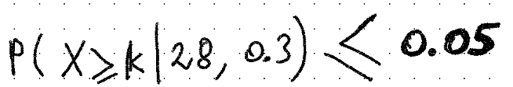
</div>

We need to identify the value for 'k' that will satisfy the equation. Solving this manually can be time consuming, therefore the following Python script I created will help here.

``` python
    
    import math

    def false_positive_rate(n=28, p=0.3, pfp=0.05):
        """
        n: Number of trials (28 for our case)
        p: probability of success (0.30 as we defined above)
        pfp: maximum false positive probability (5% as we already defined)
        """

        # k is the minimum number of sign changes we seek.
        for k in range(0, n+1):
            # Calculate the total probability given 'k'
            total = 0.0
            for i in range(k, n+1):
                total += math.comb(n,i)*(p**i)*((1-p)**(n-i))

            if total <= pfp:
                print(f"k={k} gives P={total}")
                break
            
        return k
```

When you call the *false_positive_rate()* function with the default arguments, you will get k=13 with a false positive rate of 0.0491, which is below our specified target of 5%.

To sum up, 30-day frames where we observe sign changes of 13 or more will be categorized as oscillatory. In other words, if **ZCR >= 13/28 (~0.46), a 30-day frame will be indicated to have strong oscillation.**

***OPTIONAL STATISTICS FOR THE CURIOUS MINDS***: Though we have calculated our zero crossing threshold already, I would like to share an alternative calculation method using the relationship between binomial distribution and normal distribution, which will simplify our calculations with a few approximations. You will see this alternative method will also provide the same k value.

A Bernoulli random variable represents a single trial with exactly two outcomes: success (often coded as 1) and failure (often coded as 0). A binomial variable is the sum of n independent Bernoulli variables. The central limit theorem tells us the sum of many independent, and identically distributed variables tends toward a normal distribution, **regardless of the original variable's distribution**.

Therefore, a binomial distribution can be approximated to a normal distribution under certain conditions, i.e., when the binomial distribution is not too skewed!

A practical rule when a binomial distribution can be approximated to a normal distribution is:

np >= 5 AND n(1-p) >= 5

Some textbooks define a tighter condition for stricter accuracy as:

np >= 10 AND n(1-p) >= 10

The interpretation of the above rule is as follows:
- We need enough expected success (i.e., np) and enough expected failures (i.e., n(1-p))
- If p is very small or very large, the binomial distribution is highly skewed and the approximation becomes poor.

For our particular case where n=28 and p=0.3,

np = 8.4 and n(1-p)=19.6, which satisfy the looser criterion. So considering the normal distribution approximation as alternative makes sense.

We first need to calculate the mean and the variance to characterize our approximated normal distribution. Let's first calculate the mean and variance for a single Bernoulli random variable and then generalize it to the binomial distribution, which is really easy.

Following are the general definitions of mean and variance calculation for discrete events.

<div align="center">
  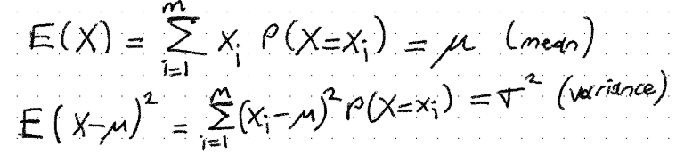
</div>

For a Bernoulli variable, 0 and 1 are the only two values. Therefore, when we compute the above equation for 0 and 1, we obtain the mean and variance expressions as a function of the success probability as follows.

<div align="center">
  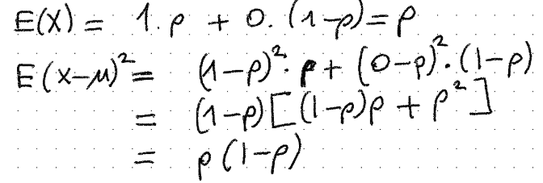
</div>

Since binomial distribution is simply the sum of **independent** Bernoulli variables, we can convert the mean and variance of a single Bernoulli variable into a binomial equivalent with n trials by adding 'n' Bernoulli mean and variance values as follows:

<div align="center">
  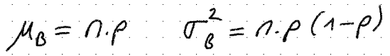
</div>

If you are wondering about the error bound for approximating a binomial distribution to a normal distribution, the Berry-Esseen theorem shows the larger the np(1-p) factor is, the better the approximation, as follows:

<div align="center">
  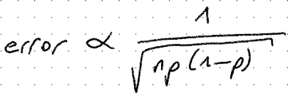
</div>

Now that we have calculated the mean and the variance for the equivalent normal distribution, we can calculate (or look up) probabilities for normalized random variables as follows:

<div align="center">
  
</div>

As you will recall, we are trying to find the number of sign changes (k) that will warrant a false positive rate below an upper bound (i.e., 5% as we saw before) However, in order to calculate k, we will first need to find the z score using the normal distribution. This problem can be stated as "what is the value 't' I can assign to z, above which only 5% of the distribution will be present?" This statement can be summarized as follows:

<div align="center">
  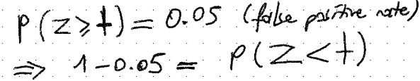
</div>

We can either use look up tables to find t in the top 5% tail of the normal distribution. This is equivalent to finding t in the bottom 95% tail of the same distribution. An alternative way is to use the following Python script that gives the t value below which a given percentile of the distribution exists.

```python
    from scipy.stats import norm

    p = 0.95  # this is the (1 - 5%) probability
    t = norm.ppf(p)
    print(t) 
```

The above calculation will yield t=1.645, which will be used to calculate k.

Before calculating k, we need to talk about the *"continuity correction"* since binomial distribution deals with discrete variables while the normal distribution approximation is continuous. Therefore, we redefine the inequality for the discrete variable X in terms of the continuous version Y as follows.

<div align="center">
  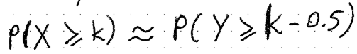
</div>

The best way to interpret the above is to think about the discrete value k as a point in the middle of a bar on a chart extending from k-0.5 to k+0.5. Therefore, for a discrete variable to be greater than or equal to k simply means its continuous version needs to be greater than or equal to k-0.5 to improve accuracy.

So we replace the k term in the previous normalization expression to (k-0.5) as follows.

<div align="center">
  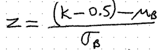
</div>

The final step now is to recall n=28 and p=0.3 for calculating the sign change threshold k, and to also use t=1.645 we calculated above. Following is how we plug the numbers to obtain k, which needs to be an integer as it belongs to a discrete distribution.

<div align="center">
  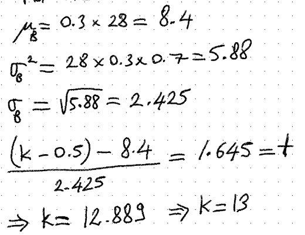
</div>

As you can see k=13 we found using the normal distribution approximation is in agreement with our manual calculation result presented in the previous section!

***5. Volatility threshold:*** This threshold will be defined for qualitatively different two regimes:
- **Low:** This is the upper limit of the quiet region where noise is small and "stationary" is meaningful.
- **High:** This is the lower limit of the high-noise region where gain fluctuations are so large that slope-based trend labels become unreliable.  

We start by defining two ranges for the low and high volatility described above for the price gains in each 30-day window. Based on empirical human visual perception, a low volatility over 30-days is chosen to be levels that fall below the 4%-5% range. Similarly, a high volatility is expected to fall above the 10% to 12% range.

The standard deviation of log of gains over each 30-day window gives the daily volatility as follows:

<div align="center">
  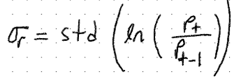
</div>

Since we are working with N=30 prices per month, we can define M=N-1 daily gain terms (as each gain is a comparison of two successive days). Therefore, the expected window-scale fluctuation over 30 days is calculaterd as follows:

<div align="center">
  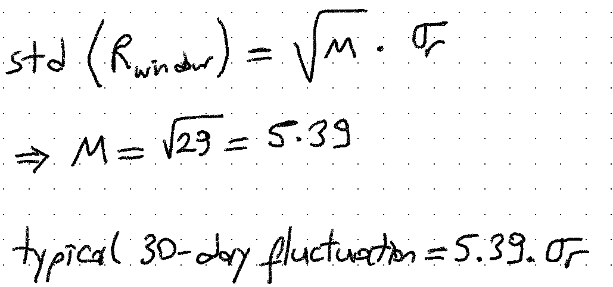
</div>

For the quiet region where the volatility is low, we need to select the low threshold according to the following inequality:

<div align="center">
  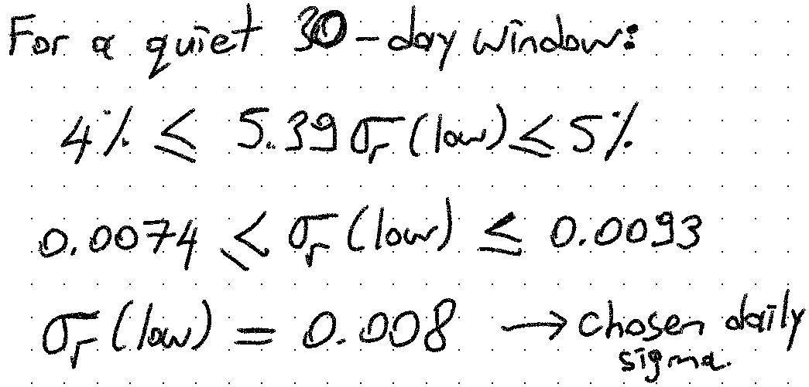
</div>

Similarly, for the noisy region where the volatility is high, we need to select the high threshold as follows:

<div align="center">
  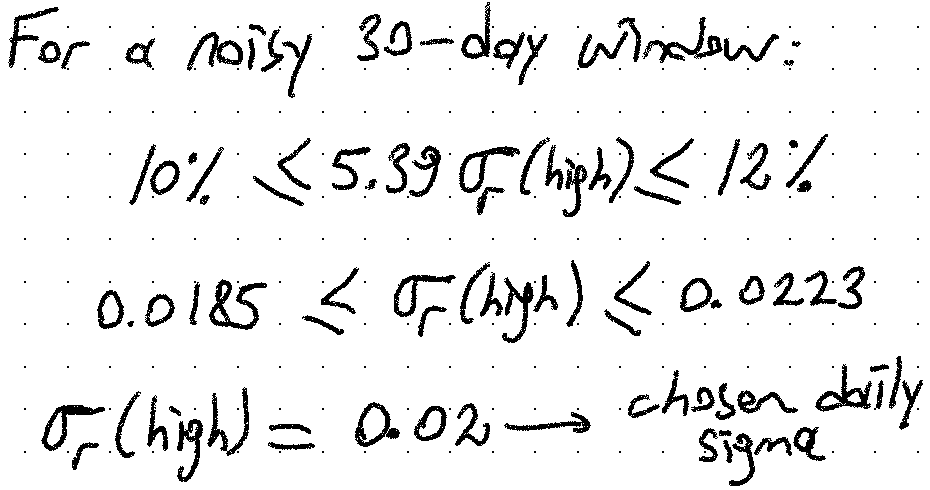
</div>

Therefore, the two sigma thresholds we will use are:  
v(low) <= 0.008 *low volatility, stationary window*  
v(high) >= 0.02 *high volatility, no trend window*

It follows that any sigma that falls between the above two thresholds is considered to be the typical regime (i.e., the medium volatility band)


### Labeling rules:
We now have all of our definitions and criteria to create our labeling rules for generating ground truth data for all of our dataset.

We need to apply the following 5 rules in the listed order to successfully create all of the labels for our dataset.

> ***Rule 1*** - STATIONARY  class
> A frame is classified as STATIONARY if it is both flat and quiet.  
> *Criteria:*  
> - |b| < 0.001  i.e., flat/near flat characteristic  
> - AND v <= 0.008  i.e., low volatility, v(low)  
> - AND z < 0.46  i.e., weak/no oscillations  

> ***Rule 2*** - OSCILLATING class
> A frame is classified as OSCILLATING if it flips direction frequently and does not have a strong trend.  
> *Criteria:*    
> - z >= 0.46  i.e., strong oscillations  
> - AND ts < 0.36 i.e., no strong trend
> - AND v > 0.008 i.e., above the low volatility threshold to ignore tiny jitters as oscillations.

> ***Rule 3*** - TREND_UP class
> A frame is classified as TREND_UP if it has a positive slope and trend dominates noise.  
> *Criteria:*    
> - b >= 0.003  i.e., strong positive slope  
> - AND ts >= 0.36 i.e., strong trend
> - AND z < 0.46 i.e., guard against oscillatory frames  
> - AND v < 0.02  i.e., guard against very noisy "trends"   

> ***Rule 4*** - TREND_DOWN class
> A frame is classified as TREND_DOWN if it has a negative slope and trend dominates noise.  
> *Criteria:*    
> - b <= -0.003  i.e., strong negative slope  
> - AND ts > 0.36 i.e., strong trend
> - AND z < 0.46 i.e., guard against oscillatory frames  
> - AND v <0.02  i.e., guard against very noisy "trends"   

> ***Rule 5*** - OTHER class
> If a frame does not satisfy any of the above 4 rules, it is classified as OTHER. This class should collect the following cases:  
> - moderate slopes *(i.e., not extreme enough for trends)*
> - moderate volatility with low/medium zero crossings
> - mixed behavior *(i.e., trend + oscillations)*
> - transitional regimes  

### Dataset Organization: ###

Entire dataset is kept in one folder called ***stock_datalake***. This folder will contain multiple csv files spanning the same time period for multiple stock tickers. The data lake will include the complete OHLCV data for the selected stocks and will be (typically) constructed once in order to avoid repetitive web calls to capture the complete data required for an analysis.

Each csv file will include 30-day OHLCV data and its name will be as follows:  
**`<ticker name>_<month index>.csv`**

***month_index*** is an integer that corresponds to the month number. For example, in a dataset that spans 3 years of 30-day OHLCV data, the ***month_index*** will start from 1 and go up to (and including) 36. 

The ***stock_datalake*** will also include a json file (called ***metadata.json***) that provides metadata on the dataset as follows:

```
{
    'start_date': '<YYYY-MM-DD>',
    'end_date': '<YYYY-MM-DD>',
    'days_per_file': <days per frame/file>,
    'months': , <total number of months per ticker>,
    'adjusted_prices': '<yes or no>',
    'tickers': [<all stock ticker strings in dataset>]
}
```
